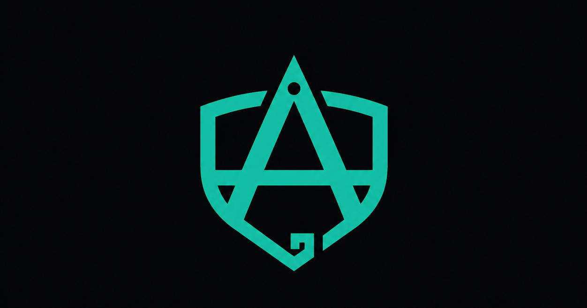

<p align="center">
  
</p>

<p align="center">
  <strong>Aegis for Laravel</strong>
</p>

<p align="center">
  Scaffolding and validation helpers for Value Objects.
</p>

<p align="center">
  Wrap your primitives and validate them at the boundary in one Artisan command.
</p>

---

## Status

v0.1 in active development. Targeting [Laravel Live Japan 2026](https://laravellive.jp/en).

## Requirements

- PHP 8.3+
- Laravel 13

## Installation

```bash
composer require harrisrafto/laravel-aegis
```

The service provider is registered automatically via Laravel's package auto-discovery.

Optional — publish the config to override the default namespace for generated Value Objects:

```bash
php artisan vendor:publish --tag=aegis-config
```

## Quick start

### Scaffold a Value Object

```bash
php artisan make:value-object Email \
    --rule=email \
    --normalize=lower \
    --method=domain:string \
    --cast=Order.email
```

Generates:

- `app/Domain/ValueObjects/Email.php` — `final readonly`, validated, normalized, `Castable`, `Stringable`, `JsonSerializable`, with an empty `domain(): string` stub for your business logic.
- `tests/Unit/EmailTest.php` — Pest stub awaiting your assertions.
- Patches `app/Models/Order.php` to add `'email' => Email::class` to its `casts()` method.

### Validate with the same Value Object

```php
use Illuminate\Validation\Rule;

public function rules(): array
{
    return [
        'email' => ['required', Rule::valueObject(Email::class)],
    ];
}
```

Aegis registers `valueObject` as a macro on Laravel's `Illuminate\Validation\Rule`, so the call site reads identically to any other built-in rule (`Rule::in(...)`, `Rule::unique(...)`).

### Resolve the validated instance from a FormRequest

```php
use HarrisRafto\Aegis\Concerns\ResolvesValueObjects;

class StoreUserRequest extends FormRequest
{
    use ResolvesValueObjects;

    public function rules(): array
    {
        return [
            'email' => ['required', Rule::valueObject(Email::class)],
        ];
    }
}

// In your controller:
$email = $request->valueObject('email'); // an Email instance, already validated
```

## Flags

| Flag | Purpose |
|---|---|
| `--rule=NAME[:ARGS]` | Curated validation rule. Supported: `email`, `url`, `ip`, `uuid`, `alpha_num`, `alpha`, `numeric`, `regex:PATTERN`. |
| `--normalize=FN[,FN]` | Composable normalization. Supported: `lower`, `upper`, `trim`. |
| `--type=PHP_TYPE` | Property PHP type. Default: `string`. Accepts enums and value classes too. |
| `--method=NAME[:RETURN_TYPE]` | Repeatable. Adds an empty method stub for your domain logic. |
| `--cast=Model.column` | Adds the cast wiring to `app/Models/Model.php`. Idempotent. |
| `--namespace=NS` | Override the configured default namespace. |
| `--no-test` | Skip the Pest test stub. |
| `--dry-run` | Print the files that would be written or changed; change nothing. |
| `--force` | Overwrite existing files. |

## Credits

Built by [Harris Raftopoulos](https://x.com/harrisrafto) for [Laravel Live Japan 2026](https://laravellive.jp/en).

YouTube: [@harrisrafto](https://youtube.com/@harrisrafto)

Companion to the talk *"Bulletproof Your Laravel Code with Value Objects"* and the example repository at [harris21/laravel-value-objects-examples](https://github.com/harris21/laravel-value-objects-examples).

Based on the Value Object pattern from Eric Evans' *Domain-Driven Design* and Martin Fowler's *Patterns of Enterprise Application Architecture*.

## License

MIT
